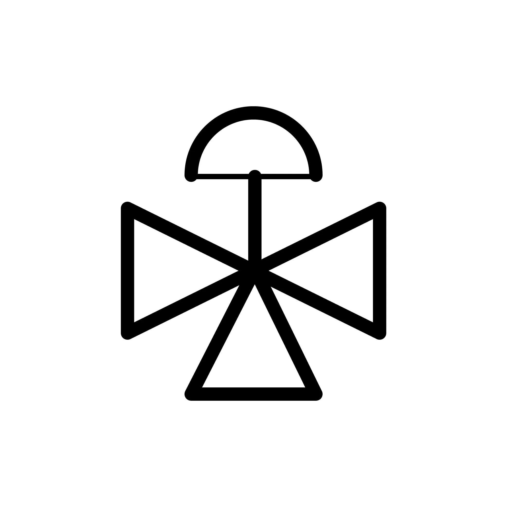

L'exercice consiste a transformer une image au format webp en une image au format svg.

Le resultat attendu sera un [simple chemin SVG](https://docs.aspose.com/svg/fr/net/drawing-basics/svg-path-data/)

[Voici un example simple](https://jsbin.com/lamiyob/edit?html,js,output) qui est une base pour faire l'excercice.